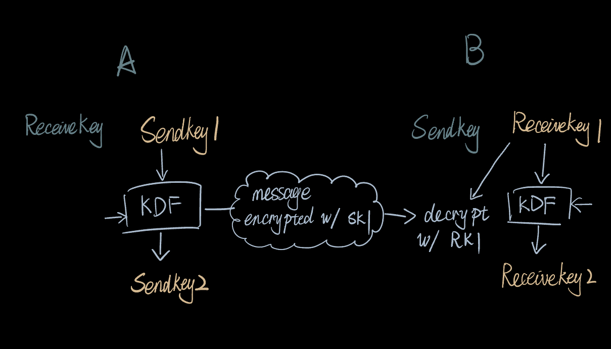
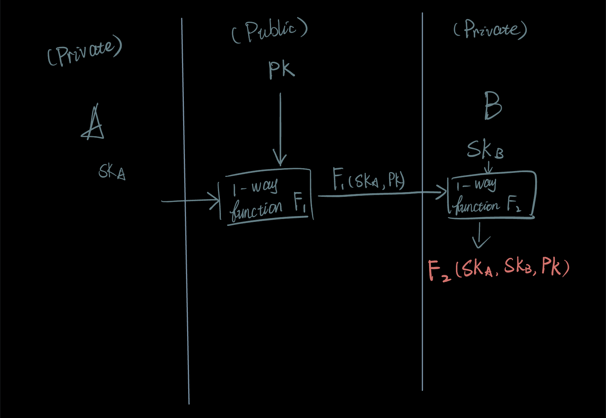
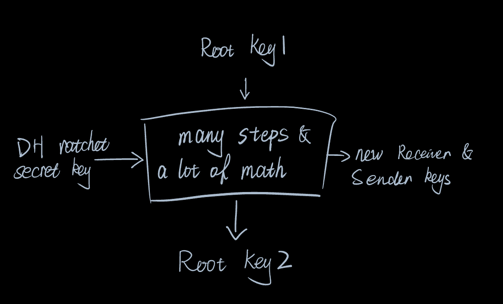

## The Two Ratchets
### The symmetric-key ratchet
In a private chat, each party has two keys for messaging: one for encryption of the next out going message and one to decrypt the next incoming message. 

The receiver key of one party should be the same as the sender key of the other party for the same message.

The keys on both side are passed through a key derivation function (KDF) to generate a new key for future encryption so each message has a different key. The update and synchronization of symmetric keys on both sides is the 1st ratchet. 

### The Diffie–Hellman(DH) ratchet
DH allows two parties to calculate for an encryption key securely without direct exchange of the key.

Say A and B want to create a shared key. 

They each has a secret key SKA and SKB, and there is a public key PK. A can use a one-way function to create a new value with SKA and PK, and send this new value to B. 

Then B can take this value from A and feed this value together with PKA to another set of algorithms to get the shared secret key. 

In this process, no secret key is directly sent to either party.

The DH ratchet executes a series of key exchange to update the messaging keys securely, so if a symmetric key is ever compromised the eavesdropper will no longer be able to decode the messages after a DH update. 

A DH update resets the symmetric keys on both sides and the receiver and sender key chains will perform a new series of key update through the KDF, until the next DH update. 

## Putting the two ratchets together 
The symmetric key ratchet ticks every time a message is sent/received. 

The DH ratchet updates the symmetric keys for additional security.

## Why is it good
If an attacker ever get a messaging key and managed to read the encrypted conversation, because the symmetric ratchet, they won't be able to read previous messages as they are all encoded with different keys. They can use the KDF to calculate the following keys but once the DH ratchet updates the symmetric keys, the key they got becomes useless. 

## Related resources
Secrete key exchange: https://www.youtube.com/watch?v=NmM9HA2MQGI
Double rachet messaging: https://www.youtube.com/watch?v=9sO2qdTci-s